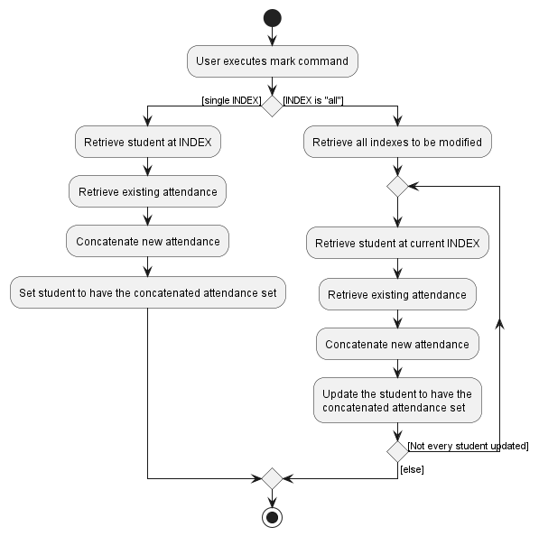
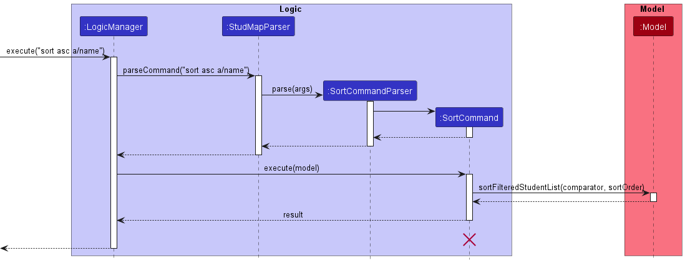

### Project: StudMap

StudMap is a lightweight desktop application that addresses your needs of managing the student records across multiple spreadsheets. Using a CLI (Command Line Interface) approach, we mitigate the need for teaching assistants to navigate through convoluted menus and buttons when keeping track of the administrative details for the students. It is written in Java with the GUI implemented using JavaFX.  

Given below are my contributions to the project.
* **Code contributed**: [RepoSense link](https://nus-cs2103-ay2223s1.github.io/tp-dashboard/?search=highorbit25)

* **New Feature**: `sort`
  - _What it does_: The `sort` features allow users to sort the StudMap by the specified attribute in the specified order.
  - _Justification_: The user (teaching assistants) might want to organise and sort the data stored on StudMap according to attributes. The user might wish to focus on certain aspect of the module to track. For instance, the user may wish to clamp down on absenteeism and identify students who are constantly missing from class. To achieve this, he can sort the StudMap by `ATTENDANCE`. Similarly, to get a better sense of participation rates in his class, the user can sort the StudMap by `PARTICIPATION` to identify those students who are lacking participation and prompt them to participate more in class.
  - _Highlights_: In the original addressbook, there were no sorting feature. After adding in new contacts into the addressbook, the whole list of contacts can get rather messy as the contacts were unsorted and displayed in the order of when they were added into the list. Having a `sort` feature can help the user to better organise the data available on the list such as sorting by `Name` to get a neater list whereby the list is sorted by `Name` in alphabetical order. Sorting is also useful to narrow down on specific `Attribute` the user is interested in and make better sense of it through sorting it in either `Ascending` or `Descending` order. To implement the feature, I have also created the `Attribute` class. Any new attributes to be enabled for sorting could be specified in the `AttributeType` enum class and the `Comparator` to be used for sorting within the `Attribute` class.

* **New Feature**: `participate` and `unparticipate`
  - _What it does_: By using the `participate`, the user (teaching assistants) can create records of participation for the student and toggle between the supported status for participation. The user can also use the `unparticipate` command to remove records of the participation components completely.
  - _Justification_: The user may wish to keep track of the participation of students in class. By introducing this feature, the user can record down the participation requirements for the module and keep track of which components students have participated in. This will help the user to view participation rates in class to identify students who lack participation as well as to determine the participation grade for students.
  - _Highlights_: `participate` and `unparticipate` works well with the `all` command to do mass recording of participation efficiently. Participation rates derived from the participation records works well with `sort` to give a StudMap sorted by participation rates.

* **Documentation**:
  - Provided the necessary documentation for the `sort`, `participate`, `unparticipate` features for both the User Guide and Developer Guide with UML Diagrams.[#108](https://github.com/AY2223S1-CS2103T-W13-1/tp/pull/108)
  - 
  - 
  - 
  - Reviewed User Guide and Developer Guide as a whole for final submission

* **Project management**:
  * Review and merge functional PRs for `v1.3` and `v1.4`
